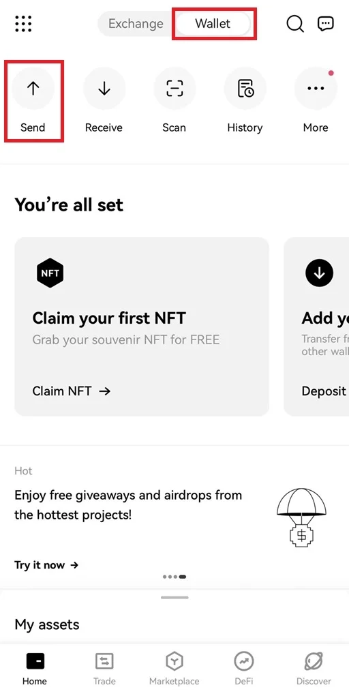
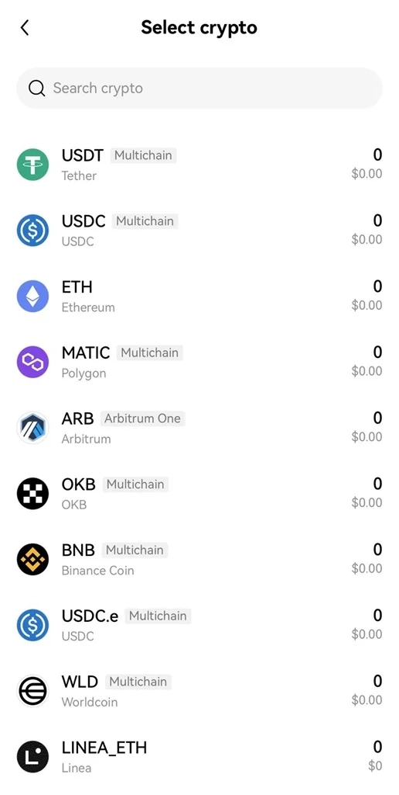
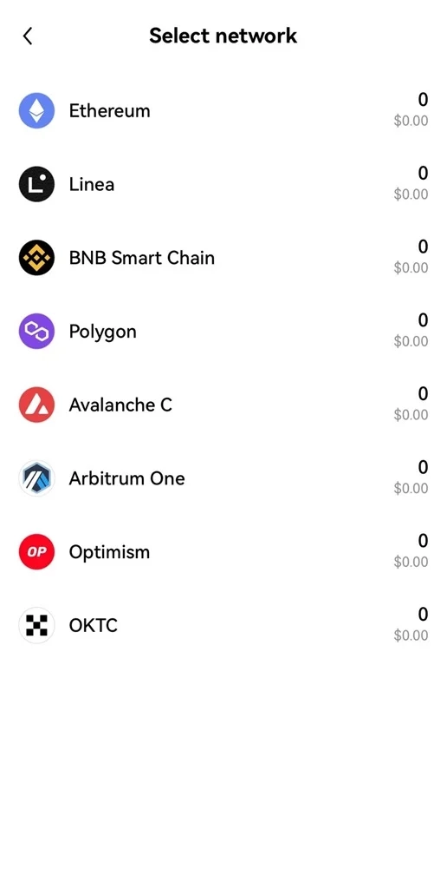
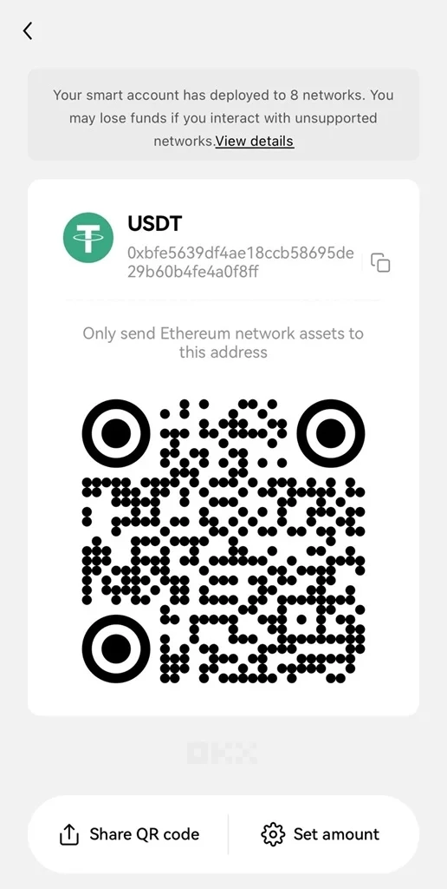
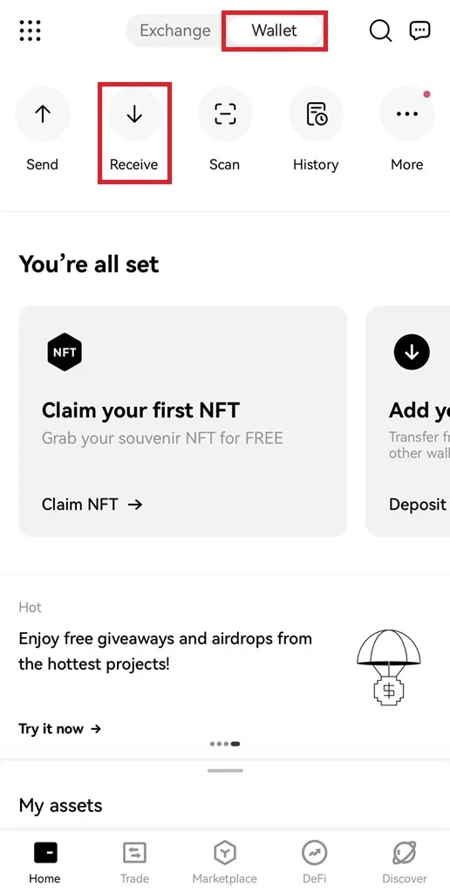
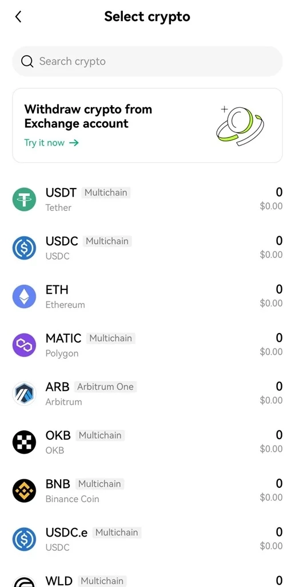
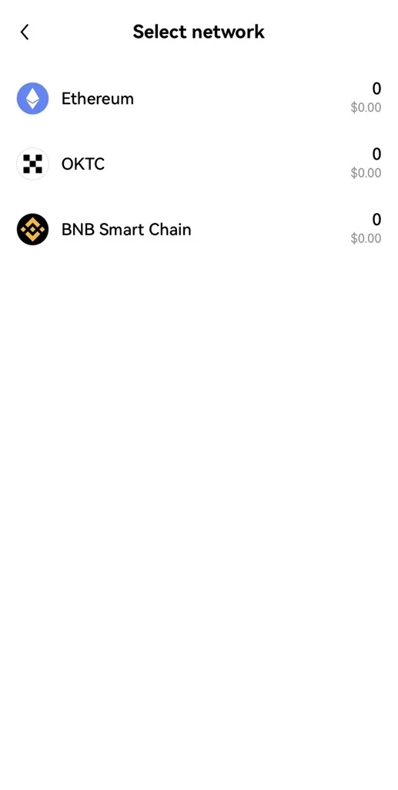
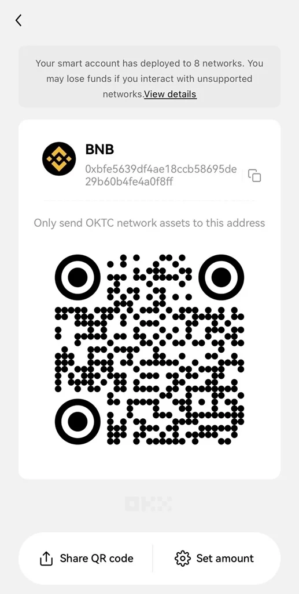

# Quick Guide to Deposits and Withdrawals on OKX Wallet

Managing crypto deposits and withdrawals doesn't have to be complicated. If you're looking for a secure, multi-chain wallet that lets you move funds quickly across different blockchains without juggling multiple wallets, you're in the right place. This guide walks you through the practical steps of depositing and withdrawing funds using OKX Wallet, covering everything from network selection to fees and transaction times.

---

## What is OKX Wallet?

OKX Wallet (also called OKX Web3 Wallet) is a decentralized multi-chain wallet that gives you comprehensive access to the Web3 world. It supports over 1,000 DApp protocols and offers features like multi-chain DEX trading, cross-chain swaps, yield farming, NFT marketplace access, and DApp exploration.

When you use OKX Web3 Wallet, you can easily connect to networks like Ethereum, Arbitrum, OKC, BSC, Aptos, and many others. This eliminates the need to create separate wallets for each blockchain, simplifying how you manage assets across multiple chains. OKX Wallet serves as your all-in-one solution for navigating Web3 conveniently and efficiently.

## Pros and Cons of Using OKX Wallet for Transactions

Before diving into deposits and withdrawals, let's look at what makes OKX Wallet stand out and where it might have limitations.

### Advantages of Trading on OKX Wallet

OKX Wallet offers several standout benefits:

- **High Security:** The wallet uses advanced security measures, including multi-layer encryption and two-factor authentication (2FA), ensuring your assets stay protected.
- **Multi-Chain Support:** It supports popular blockchains like Ethereum, OKC, BSC, and Aptos, letting you manage assets across platforms without creating multiple wallets.
- **Fast Transactions with Low Costs:** The system is optimized to process deposits and withdrawals quickly with minimal fees, delivering high efficiency.
- **Diverse DApp Access:** With over 1,000 DApp protocols available, you can explore and participate in decentralized applications like DeFi, NFT, and GameFi directly from your wallet.
- **Multi-chain and Cross-chain DEX:** The wallet supports trading on various decentralized exchanges and seamlessly converts assets between blockchains.
- **Yield Farming:** It provides various yield farming and staking features to help you maximize returns on your assets.
- **NFT Trading:** You can easily buy, sell, and manage NFT assets through the built-in NFT marketplace.

### Drawbacks of Using OKX Wallet

Despite its many strengths, OKX Wallet has a few limitations:

- **Multi-chain Complexity:** Managing assets across multiple blockchains can be challenging for newcomers to crypto and related technologies.
- **Security Responsibility:** While OKX Wallet uses modern security measures, no system is completely foolproof. Users still face potential risks from losing private keys or network attacks.

Overall, OKX Wallet's advantages far outweigh its limitations. If you're looking for a reliable solution for crypto transactions, 👉 [start exploring what OKX Wallet can do for your portfolio](https://www.okx.com/join/47044926).

## How to Deposit and Withdraw from OKX Wallet

Let's walk through the practical steps for managing your funds on OKX Wallet. These instructions will help you easily handle deposits and withdrawals.

### How to Deposit Funds into OKX Wallet

Here's how to deposit money through the OKX Wallet mobile app. Download the app first, then follow these steps:

**Step 1:** Go to the OKX homepage: https://www.okx.com/

Select "Wallet" and then click on "Deposit."

**Step 2:** A list of cryptocurrencies will appear. Choose the one you want. For faster access, use the search function and type the currency name.

**Step 3:** After selecting your cryptocurrency, choose the "Network."

**Step 4:** The deposit address appears as a QR code. Click "Set Amount," enter the amount you want to deposit, then proceed to transfer the funds to complete the process.

### How to Withdraw from OKX

Withdrawing follows a similar process to depositing. Here are the detailed steps for withdrawing funds from OKX Wallet:

**Step 1:** On the OKX app homepage, select "Wallet," then click "Withdraw."

**Step 2:** Find and select the cryptocurrency from the displayed list.

**Step 3:** Select a "Network" from the available options.

**Step 4:** Enter the "Amount" and confirm the Address, Network, and Fee, then click "Send." Complete two-factor verification and select "Confirm" to finalize the withdrawal.

**Important Notes:**

- To avoid losses or unexpected issues, ensure the withdrawal network matches the deposit network at your destination wallet.
- The withdrawal amount must exceed the minimum but stay within the allowed limit.

## Fees and Transaction Processing Times

OKX doesn't charge fees for deposits or withdrawals at the platform level. However, blockchain networks may apply their own network fees (gas fees), which vary depending on the cryptocurrency and network congestion. Transaction processing times also depend on the specific cryptocurrency and network conditions—some transactions confirm in minutes, while others might take longer during peak times.

## Deposit and Withdrawal Limits

When depositing or withdrawing, pay attention to transaction limits. These vary based on your account verification level and the specific cryptocurrency you're using. Higher verification levels typically unlock larger transaction limits. Check your account settings for your current limits before initiating large transactions.

## Important Notes for Deposits and Withdrawals

When depositing and withdrawing from OKX Wallet, keep these important points in mind to ensure safe and efficient transactions:

- Make sure you're using the correct wallet address corresponding to the cryptocurrency you want to deposit or withdraw. For example, if you're depositing Bitcoin, use a Bitcoin wallet address.
- Double-check the wallet address before sending or withdrawing funds to avoid sending to the wrong destination. Once a transaction is executed, it cannot be reversed.
- While OKX doesn't charge deposit and withdrawal fees, blockchain networks may still apply fees. Check these fees before completing your transaction.
- Transaction confirmation times depend on the cryptocurrency type and network status. Be patient if a transaction takes longer than expected.
- Review deposit and withdrawal limits and ensure you don't exceed the limits set by OKX.

---

## Conclusion

We've covered everything you need to know about OKX Wallet and provided detailed steps for depositing and withdrawing funds. With this information, you should be able to handle your transactions quickly and smoothly. Whether you're managing multiple blockchain assets or just getting started with crypto, 👉 [OKX Wallet offers the security and convenience you need for seamless fund management](https://www.okx.com/join/47044926).

### Frequently Asked Questions

**How do I deposit and withdraw from OKX Wallet?**

Open the OKX app, select "Wallet," then choose deposit or withdrawal. Select your cryptocurrency and network, enter the amount you want to send or withdraw, and confirm the transaction.

**How can I ensure safety when depositing/withdrawing on OKX?**

For maximum safety, enable two-factor authentication (2FA), back up your security keys, carefully verify wallet addresses, and never share your login information or 2FA codes with anyone.

**Are there limits for deposit/withdrawal transactions?**

Yes, depending on your account verification level. There may be minimum and maximum deposit/withdrawal limits for daily or monthly transactions.
